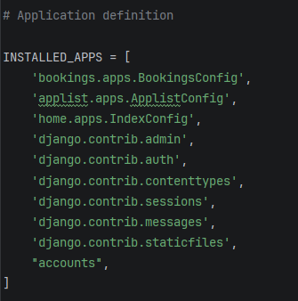
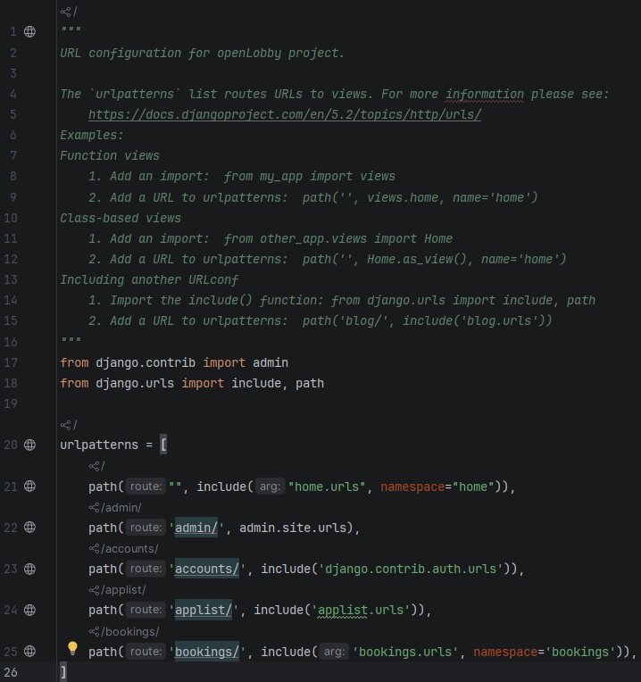
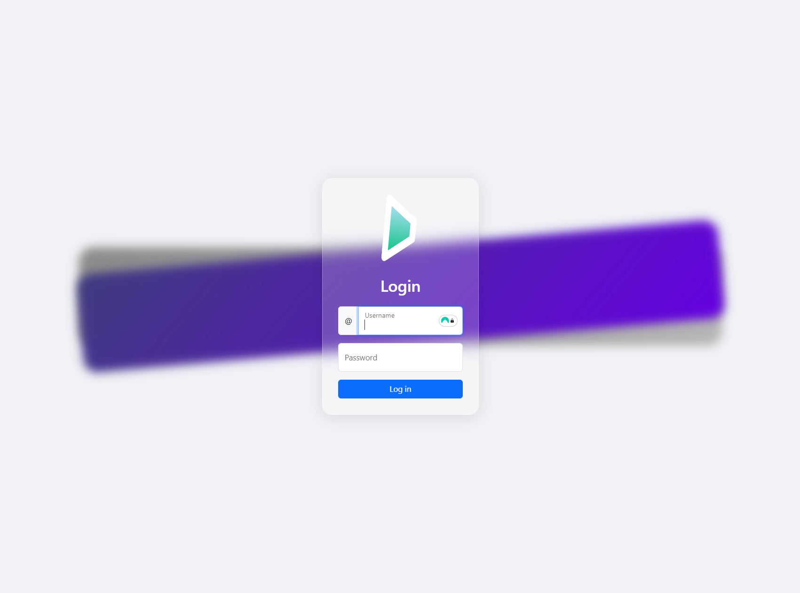
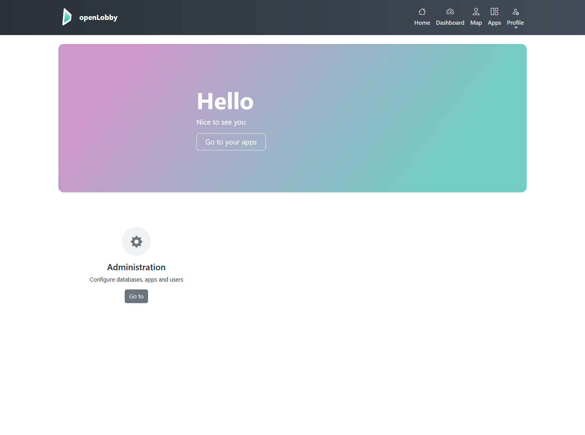
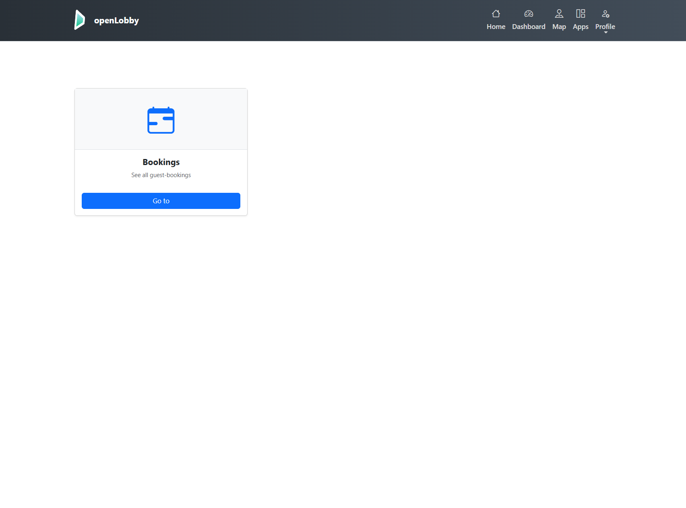

<p align="center">
  
</p>

# openLobby


openLobby is a modular management platform built with Django. It features a dynamic dashboard with role-based access control, automated Docker deployment, and a robust PostgreSQL integration.

## Features

* **Modular Dashboard**: Applications register themselves automatically via their internal configuration.
* **Role-Based Access Control (RBAC)**: Integrated permission checks for specific user groups (e.g., "Premium" status).
* **Dockerized Environment**: Fully automated setup including database migrations and static file management.
* **Clean UI**: Responsive design using Bootstrap 5, custom CSS, and dynamic iconography.

## Technical stack
| Layer              | Technology                |
|--------------------|---------------------------|
| **Backend**        | Python 3.11, Django 4.2+  |
| **Database**       | PostgreSQL 15 |
| **Infrastructure** | Docker & Docker Compose |
| **Frontend**       | Bootstrap 5, Bootstrap Icons, Custom CSS |

## Installation and setup

### 1. Clone the repository
```bash
git clone https://github.com/ykilian/openLobby.git
cd openLobby
```

### 2. Configure Environment (Optional)
The project uses default credentials for development in the [docker-compose.yml](docker-compose.yml) file. For production environments, update the `POSTGRES_PASSWORD` and `DATABASE_URL` variables accordingly.

### 3. Start the application
Run the following command to build the image and start the containers:
```bash
docker-compose up --build -d
```
The `-d` flag runs the containers in the background.
The application should now be available at http://localhost:8000.

## Post-installation

### Create a superuser
The system automatically handles database migrations and admin creation upon startup. To create another superuser account:
```bash
docker-compose exec web python manage.py createsuperuser
```
You can also do that by 
1. Navigate to http://localhost:8000/admin/
2. Log in with your superuser credentials
3. Under Authentication and Authorization, click on Users
4. Click Add User and fill in the required fields
5. Save the user

## Project structure
* `index/`: Main application logic and dashboard views
* `applist/`: Logic for application discovery and permission filtering
* `static/`: Global assets including CSS and images
* `templates`: Base HTML structures and navigation components
* `docker-compose.yml`: Orchestration of web and database services
* `Dockerfile`: Instructions for building the Python environment
* `entrypoint.sh`: Script for automated migration and service initialization

## Adding new modules
To integrate a new application into the dashboard:

1. Create the Django app: ```python manage.py startapp my_new_app```
2. Register the app in [settings.py](openLobby/settings.py)


3. Define these metadata in your `apps.py`

```
class MyNewAppConfig(AppConfig):
    name = 'my_new_app'
    display_name = "My New Module"
    description = "A brief description of this module's purpose."
    icon = "bi-star"
    required_group = "Premium"
```

4. Define the apps url in [urls.py](openLobby/urls.py)`urls.py`
5. OPTIONAL: If you gave the app a different `required_group`, you need to create this group in the admin panel and assign it to the users you want to have access to it.



## How to use
The app comes with a predefined superuser account.

IMPORTANT!
Default Credentials (Development only):

**Username:** `admin`

**Password:** `admin`

Use these credentials to log in.

<p>
  
</p>

<p>
  
</p>

If you click on `Apps` in the navigation bar, you should see a list of all installed applications, that you have access to.

<p>
  
</p>

## Preinstalled Applications
* [bookings/](bookings/README.md): Booking management system

## License
This project is licensed under the MIT Lic